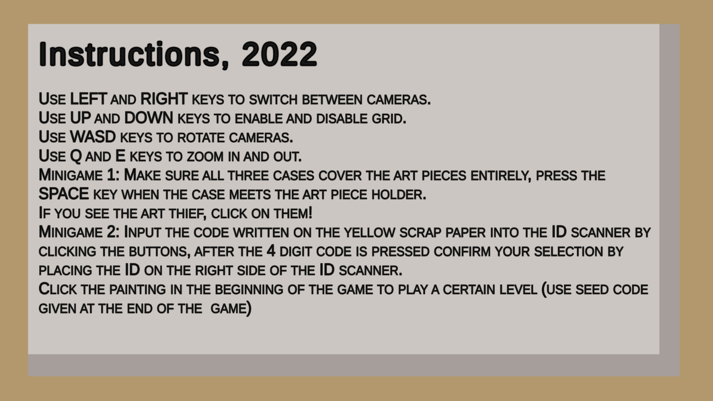
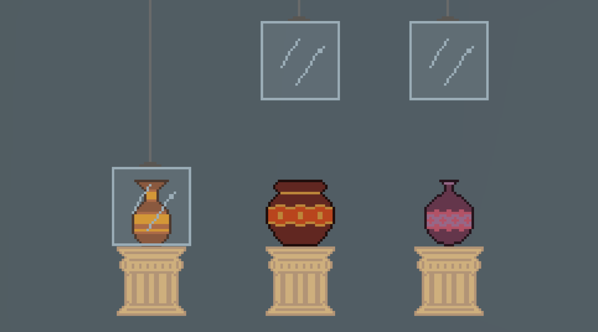

# Secure The Art Gallery

  <h3>
    Play the game: 
    <a href="https://paper-clips.github.io/SecureTheArtGallery/">link</a>
  </h3>

 

## Start screen

  

## In game

  

  

## Mini games

  

## End screen

## Imported Assets Sources:
- [3Dfrk](https://assetstore.unity.com/packages/3d/props/interior/picture-frames-with-photos-106907)
- [Asset Store](https://assetstore.unity.com/packages/2d/textures-materials/wood/wood-pattern-material-170794)
- [AssetStoreOriginals](https://assetstore.unity.com/packages/3d/environments/snaps-prototype-office-137490)
- [ExplosiveLLC](https://assetstore.unity.com/packages/3d/animations/rpg-character-mecanim-animation-pack-free-65284)
- [Kevin Iglesias](https://assetstore.unity.com/packages/3d/animations/basic-motions-free-154271)
- [LowCharacterPack](https://assetstore.unity.com/packages/3d/characters/low-character-pack-free-sample-192954)
- [Nice Materials Pack 2](https://assetstore.unity.com/packages/2d/textures-materials/nice-materials-pack-vol-2-67599)
- [Nokobot](https://assetstore.unity.com/packages/3d/environments/historic/greek-temple-vases-149134)
- [SimpleGridShader](https://assetstore.unity.com/packages/tools/simple-grid-shader-119988)
- [Animations](https://www.mixamo.com)
